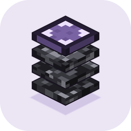

<p align="center">
  <picture>
    <source media="(prefers-color-scheme: dark)" srcset="assets/branding/icons/bedrock-layers-icon-dark-256.png">
    <source media="(prefers-color-scheme: light)" srcset="assets/branding/icons/bedrock-layers-icon-white-256.png">
    
  </picture>
</p>
<h1 align="center">Bedrock Layers</h1>

Formerly Advanced Structure Inspector.

Web app for **Minecraft Bedrock** `.mcstructure` files: import, catalog, 3D preview, layer browse, inventory inspect, materials list, and notes — all in the browser.

The current version is **0.1.158**. The title shows that number, with no “build” label. The `version` field in `package.json` uses the same number.

No backend required. Catalog and files persist in this browser’s **IndexedDB**. If a write fails, the status line says `Couldn't save changes` and the reason. Geometry is Bedrock Layers’ own Three.js pipeline. Normal viewing does not generate a resource pack. The optional HoloPrint pack generator is separate from the inspector.

Bedrock Layers is co-authored and co-developed by [JaydeeWetwork](https://github.com/JaydeeWetwork) and Grok Build (xAI). Jaydee directs the product. Grok Build is the coding agent used to implement and revise it.

This repository is a **fork / Adapted Material** of [HoloPrint](https://github.com/SuperLlama88888/holoprint) (CC BY-NC-SA 4.0). See [NOTICE.md](./NOTICE.md) and [FORK.md](./FORK.md).

> **License:** [CC BY-NC-SA 4.0](./LICENSE) — Attribution, **NonCommercial**, ShareAlike.

---

## Features

- Import `.mcstructure`, and structures from `.mcworld`, `.mctemplate`, `.mcpack`, `.mcaddon`, and `.zip`
- **Catalog** with categories, entries, search, pins, creator, credits, and a source link
- **Editor** for categories, entries, features, and named catalog databases
- **3D preview** — orbit, iso N/S/E/W, top-down, fly (WASD, Space, Shift), and a Y-layer slice. Each structure can store a default camera and zoom
- **Shapes** — fence posts grow rails toward a fence, a fence gate, or a solid block. A glass pane is a thin post plus an arm toward another pane, iron bars, or a solid block, including glass. Iron bars stay a full sheet. Floor coral fans are a low four-blade cross. Wall coral fans are two sheets on the supporting face. Water and lava on a waterlogged stair or slab sit just inside the cell
- **Newer blocks** keep the states saved in the file. The status line says how many, and names the ones with no shape
- **iPad Safari** — edge swipes for the catalog, details, and camera, pinch-zoom, long-press inspect, and three-finger layer taps
- **Inspect** — double-click or long-press blocks and entities: chests, hoppers, shulkers, brewing stands, composters, minecarts, signs, and item frames, including filled buckets
- **Materials list** — counts, stacks and shulkers, acquired checkboxes
- **Notes** — per-structure details

---

## Usage

See **[docs/USAGE.md](./docs/USAGE.md)** for hotkeys, catalog, preview, inspect, **iPad Safari / touch**, and common issues.

Short path: **Import…** → pick a structure in the left list → preview builds → double-click (or long-press on iPad) to inspect. On iPad, swipe from the 3D view to open Structures, Details, and the camera bar — [touch gestures](./docs/USAGE.md#touch--ipad-safari). Data stays in this browser. **Clear list** wipes the catalog and stored files for this site.

Bedrock `.mcstructure` format 1 and 2 are accepted. Version 2 may omit an empty waterlog layer. A version 2 file with `compression` 1 stores the `structure` compound as a zlib byte array, and that payload is read. Java Edition NBT, gzip, zlib wrappers, litematic, schematic, format version 3, and any other `compression` value are rejected. A file over 64 MiB, or NBT nested past 64 levels or past 2,000,000 nodes, is rejected. A world or template database is counted while it inflates, under the same 64 MiB and 1000:1 caps. Sign and book JSON nested past 100 levels is left blank, and a flattened line stops at 8,192 characters.

---

## How to run

Requires **Node.js 22 or 24 LTS** and a browser with **WebGL2** (Chrome, Edge, Firefox, or **Safari** — including iPad).

```bash
npm ci
npm run serve
```

Open **http://localhost:5173**. Stop the server with **Ctrl+C** in that terminal.

First load uses the network for libraries (esm.sh) and vanilla Bedrock textures (jsDelivr). Any static server pointed at `src/` also works.

Production:

```bash
npm run build
npm run serve:dist
```

Deploy the **`dist/`** folder to any static host.

The source repository is [JaydeeWetwork/bedrockLayers](https://github.com/JaydeeWetwork/bedrockLayers). The published site is [jaydeewetwork.github.io/bedrockLayers](https://jaydeewetwork.github.io/bedrockLayers/).

Full install, tests, and troubleshooting: **[docs/SETUP.md](./docs/SETUP.md)**.

---

## Documentation

| Doc | Contents |
|-----|----------|
| **[docs/USAGE.md](./docs/USAGE.md)** | Using the app: catalog, preview, hotkeys, inspect, iPad Safari / touch |
| **[docs/SETUP.md](./docs/SETUP.md)** | Install, run, build, tests, common issues |
| **[docs/RELEASE.md](./docs/RELEASE.md)** | 0.1.158 release notes |
| **[docs/apis/README.md](./docs/apis/README.md)** | Viewer APIs (catalog, ingest, NBT, inspect, preview) |
| **[docs/official-resources.md](./docs/official-resources.md)** | Mojang/Microsoft samples, Learn docs, EULA |
| **[NOTICE.md](./NOTICE.md)** | Attribution |

---

## Credit

- **HoloPrint** by [SuperLlama88888](https://github.com/SuperLlama88888) and [contributors](https://github.com/SuperLlama88888/holoprint/graphs/contributors)
- Upstream also credits Structura, NBTify, and others — see [NOTICE.md](./NOTICE.md)

## License

[CC BY-NC-SA 4.0](./LICENSE). NonCommercial use only. ShareAlike applies to adaptations.
