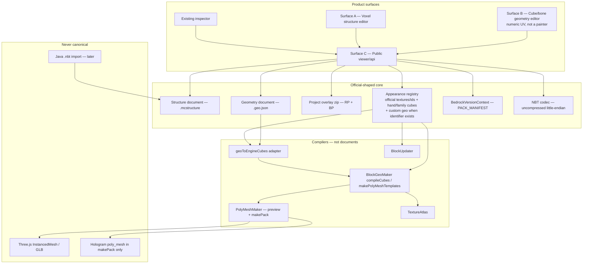
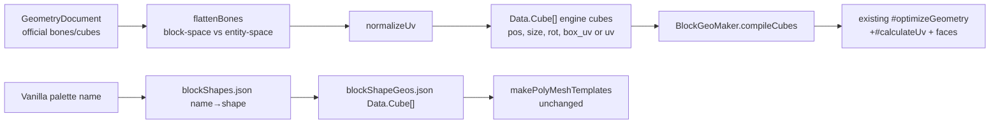
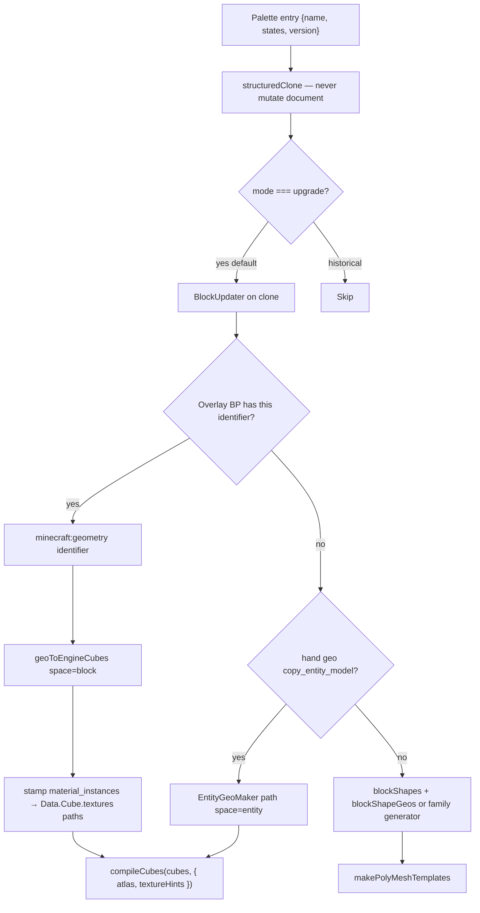
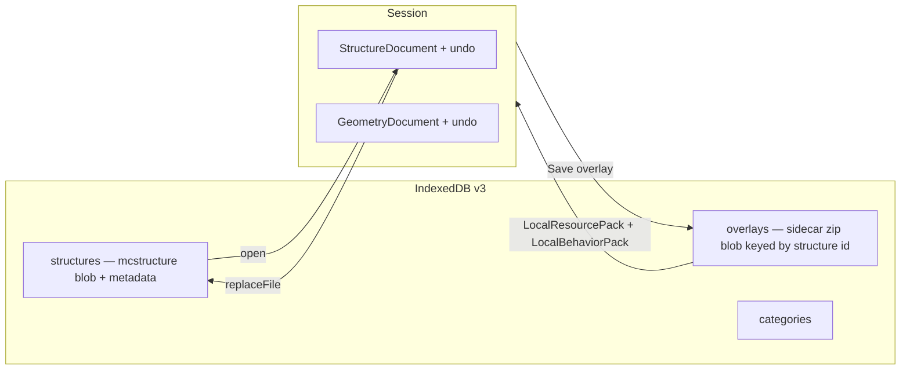

# Advanced Structure Inspector — Official-Shaped Authoring Core

| Field | Value |
|-------|--------|
| **Title** | One core, three surfaces: voxel structure editor, cube/bone geometry authoring, and a public geometry API on official Mojang/Microsoft Bedrock artifacts |
| **Author** | TBD |
| **Date** | 2026-08-23 |
| **Status** | Draft (rev 4 — user-resolved `min_engine_version` OQ) |
| **Product** | Advanced Structure Inspector (ASI / structure-db-viewer) |
| **Workspace** | `D:\source\repos\structure-db-viewer` |
| **Supersedes / extends** | [`docs/APPEARANCE_ARCHITECTURE.md`](D:\source\repos\structure-db-viewer\docs\APPEARANCE_ARCHITECTURE.md) (keep; this document *re-homes* its canonical model onto official Bedrock artifacts and is honest about where vanilla cubes still live) |
| **Related** | [`docs/API.md`](./API.md), [`docs/WORKFLOW.md`](./WORKFLOW.md), [`docs/BEDROCK_ARCHIVES.md`](./BEDROCK_ARCHIVES.md), [`docs/NBT_VALIDATION.md`](./NBT_VALIDATION.md), [`docs/sec_nbt_findings.md`](./sec_nbt_findings.md), [`docs/sec_nbt_plan.md`](./sec_nbt_plan.md), [`FORK.md`](../FORK.md) |

---

## Overview

ASI today is a local-first Bedrock **inspector**: catalog `.mcstructure` files in IndexedDB, parse NBT independently of pack generation (`src/viewer/parseStructure.js`), and preview voxels by compiling a palette through `BlockGeoMaker` → `TextureAtlas` → Three.js `InstancedMesh` (`src/viewer/structurePreview.js`). It has **no** public geometry API (`src/viewer/api/geometry.js` does not exist), **no** cube/bone `.geo.json` authoring UI, and **no** voxel structure editor that writes `.mcstructure`. HoloPrint heritage (`src/HoloPrint.js` `makePack`) still emits hologram `poly_mesh` bones; that is a pack compile target, not an authoring model.

The product request is a mix of all three capabilities, with architecture **close to official Mojang and Microsoft Bedrock APIs** so a Minecraft version bump is cheaper: pin + re-validate + curated diffs, not a rewrite of a private mesh IR.

**Answer: yes — one product, three surfaces, one official-shaped core.** Not three apps.

What is actually 1:1 with Mojang/Microsoft:

| Document | Official artifact | Role |
|----------|-------------------|------|
| Voxel SoT | Uncompressed little-endian `.mcstructure` NBT | Surface A |
| Custom-model SoT | RP `models/**/*.geo.json` cubes/bones + BP `blocks/*.json` | Surface B |
| Vanilla **ids / textures / schemas** | `bedrock-samples` `blocks.json`, `terrain_texture.json`, `item_texture.json`, `mojang-blocks.json`, `metadata/json_schemas/**` | Appearance registries + CI |
| Upgrade | SuperLlama `BedrockBlockUpgradeSchema` via `BlockUpdater.js` | Old palette → render baseline |

What is **not** in official samples and must not be advertised as such:

- Vanilla **visual cubes** (stairs, slabs, doors, …) are **not** shipped as `models/**/*.geo.json` in `Mojang/bedrock-samples`. They remain `src/data/blockShapeGeos.json` plus family generators.
- “Prefer official geo” applies **only** when a `minecraft:geometry` identifier exists (user BP, or the few `copy_entity_model` rows such as copper golem statues in `blockShapeGeos.json` lines 5573–5605).

Three.js meshes, hologram `poly_mesh`, `.glb`, and compiler `ShapeSpec` are **adapters**, never saved documents.

---

## Background & Motivation

### Current product

ASI is a HoloPrint fork (CC BY-NC-SA 4.0; see `NOTICE.md`). The inspector shell is `src/index.html` + `src/index.js` → `src/app/` + `src/ui/` → `src/viewer/api/*`. [`docs/WORKFLOW.md`](D:\source\repos\structure-db-viewer\docs\WORKFLOW.md) habit 3 and [`docs/API.md`](D:\source\repos\structure-db-viewer\docs\API.md) already require the app shell **not** to import `src/viewer/systems/` or HoloPrint entry points.

What exists:

| Capability | Where | Gap |
|------------|-------|-----|
| Catalog ingest / IndexedDB | `src/viewer/ingest.js`, `parseStructure.js`, `db.js`, `catalog.js` | Read-only blobs; `StructureCatalog.patch` is **metadata-only** (does not assign `file`) |
| Inspect | `src/viewer/inspectStructure.js` via `viewer/api/inventory.js` | NBT is data, not an editor |
| Preview without `.mcpack` | `structurePreview.js` → `PreviewRenderer` → `BlockGeoSystem` / `LayerMeshSystem` | Re-parses NBT; compiles voxels to faces |
| Palette upgrade | `src/viewer/palette.js` `tweakBlockPalette` → `BlockUpdater` | Preview-only clone: strips `minecraft:`, **deletes `version`**, ignores `air` / `light_block_*` |
| Vanilla textures / recipes | `src/fetchers.js`, `itemIconLoader.js`, **`craftRecipe.js`** | Three **hardcoded** tags; recipes also pin `v1.26.40.26-preview` |
| Hologram pack | `HoloPrint.makePack` + `packTemplate/models/entity/holoprint.hologram.geo.json` (`format_version` **1.16.0**) | Writes `poly_mesh` per Y-layer bone |
| JSON “schemas” | `src/data/schemas/*.schema.json` | **ASI-owned** engine `Cube`, **not** Microsoft geometry schemas |
| NBT write | `scripts/fill-sign-test-text.mjs` uses writable `nbtify` with **no endian argument** | Fixture only; runtime parse is `nbtify-readonly-typeless` |
| Official-geo reader | `EntityGeoMaker.entityModelToCubes` | Lossy entity adapter: requires `minecraft:geometry[]`, boxed UV only, `translate: [8,0,8]`, **ignores bone parent/pivot/rotation** |

Public `src/viewer/api/index.js` today exports icons, inventory, catalog, previewSession, build, ingest only.

`src/app/` / `src/ui/` do not import HoloPrint. Pre-existing: `src/components/ItemCriteriaInput.js` still does (pack UI). `PreviewRenderer.v3.js` exists and is unused by this design.

### Pain points

1. Minecraft updates are expensive because vanilla **cubes** are a ~106 KB hand file (`blockShapeGeos.json`, 5610 lines) plus `blockShapes.json` (268) and `blockStateDefinitions.json` (361) — originally adapted from Structura / old `blocks.json` **shape enums**, not cube geometry in samples.
2. Nearby converters are not this product (Blockbench structure plugin lacks `.mcstructure`; Structura armor-stand bones; HoloPrint hologram `poly_mesh`; Bloxelizer meshes).
3. `poly_mesh` is deprecated on `minecraft:geometry.v1.21.0` (content errors; Creator Tools GEOFMT101). ASI must not teach users to author it. Preview is **not** hologram geo.json, so Microsoft hologram errors do not blank the inspector.
4. Catalog and preview do not share an NBT object. `parseStructureFile` does not import `BlockGeoMaker`. That independence is a feature; editors need an in-memory Structure document plus `buildPreviewAssetsFromDocument` so they are not forced through a synthetic `File` (`previewCache.js` is `WeakMap<File>`).
5. Pack pins have drifted: `src/fetchers.js` (`bedrock-samples@v1.26.40.26-preview`, `BedrockData@6.7.0+bedrock-1.26.30`, `BedrockBlockUpgradeSchema@5.2.0+bedrock-1.21.110`); `itemIconLoader.js` re-hardcodes the samples tag + fallback `v1.21.50.7`; **`src/viewer/craftRecipe.js` also hardcodes `v1.26.40.26-preview`**. `PACK_MANIFEST.json` is not implemented. `BlockUpdater.LATEST_VERSION = 18168865` (`1.21.60.33`) already lags both samples `1.26.40` and the schema tag `bedrock-1.21.110`.

### Why official-shaped core (honest cost model)

User custom blocks and `.mcstructure` round-trip **do** get cheaper with a pin + Microsoft/schema validation + diffs.

Vanilla **new block shapes** still need hand `blockShapeGeos` or family generators. A pin bump is **hours–a day** for texture/id/schema drift; **days** when a new vanilla *shape* has no family generator. Do not claim otherwise.

---

## Goals & Non-Goals

### Goals

1. One product, three surfaces on one core.
2. Canonical **documents** are official artifacts where those artifacts exist (structure NBT, custom geo.json, BP block JSON). Vanilla cubes stay hand/family data behind an appearance registry that prefers official **texture/id** files.
3. Public `viewer/api` for geometry, structure, appearance/version — used by ASI preview **and** both editors. App shell still must not import `systems/` or `HoloPrint.js`.
4. Reuse existing engines. Do not rewrite `BlockGeoMaker` cube math (`#calculateUv`, `#optimizeGeometry`) as a prerequisite.
5. Catalog parse stays HoloPrint-free.
6. Preview continues without generating `.mcpack`.
7. Explicit Minecraft update story via one `src/data/PACK_MANIFEST.json`.
8. Phased, independently mergeable PRs; editor **UIs are a milestone of several PRs**, not one merge.
9. Custom geo/BP round-trips with catalog structures via an explicit **project overlay**.
10. Honest limits: Java `.nbt` adapter-only; entities round-trip without an entity studio; redstone is NBT; 50-cube block warning; `poly_mesh` export-only; no official Mojang `.mcstructure` schema file; `minecraft:voxel_shape` is a **non-goal**.

### Non-goals

- A second desktop app, a Blockbench fork, or wrapping Blockbench as the ASI core.
- Authoring hologram `poly_mesh`.
- Making `ShapeSpec` / `blockShapeGeos.json` the long-term canonical **document** (they remain the vanilla-cube **dataset** until family generators cover a family).
- Perfect historical geometry on day one — default is **upgrade-to-render**.
- Rich entity rigging, Molang animation authoring, redstone **simulator**.
- `minecraft:voxel_shape` collision/culling authoring (Learn 1.21.110; samples `metadata/json_schemas/server/voxel_shapes/1.21.110/VoxelShapeFile.json`). Collision_box on BP JSON is stored/round-tripped as JSON, not that artifact.
- Executing pack scripts, a backend, or changing CC BY-NC-SA 4.0.
- Java world / `.mca` / litematic / schematic as first-class documents.
- Rewriting Three.js systems except dirty-Y / incremental instance updates needed by the voxel editor.
- Inverting layers so `HoloPrint.makePack` imports `viewer/api`.
- Dual preview pipelines behind a flag after parity.

---

## Key Decisions

| # | Decision | Rationale |
|---|----------|-----------|
| K1 | **One product, three surfaces, one core.** | User asked for a mix; shared codecs are the expensive part. |
| K2 | **Documents:** voxel = `.mcstructure`; custom model = cube/bone `.geo.json` + BP `blocks/*.json`. Vanilla look = hand geos / family generators + official **texture/id** registries. | Vanilla visual cubes are not in samples `models/**/*.geo.json`. |
| K3 | **`ShapeSpec` is compiler IR.** `ShapeSpec.cubes` is engine `Data.Cube[]` (`src/data/schemas/index.ts`), **not** `OfficialCube[]`. Convert official cubes in a dedicated adapter. | Three IRs exist today; typing them as one is not implementable. |
| K4 | **Custom models = bones + cubes.** On-disk `format_version` string for **new files is `"1.12.0"`** (widest Blockbench / min-engine). **Export option** `"1.21.0"`. Schema *id* `minecraft:geometry.v1.21.0` is documentation, not the JSON field. | K15 replacement; marketplace min-engine friendliness. |
| K5 | **`poly_mesh` is hologram-pack compile only.** Editors refuse to author it. `makePack` keeps using `PolyMeshMaker` in `HoloPrint.js`. Hologram template stays **`format_version` 1.16.0** (`packTemplate/models/entity/holoprint.hologram.geo.json`; pack `min_engine_version` `[1,16,0]`). | Deprecated in 1.21.0; GEOFMT101; do not invert HoloPrint → viewer/api. |
| K6 | **Voxel SoT is uncompressed LE `.mcstructure`**, `format_version: 1`, `palette.default` only. | Vanilla save/load contract. |
| K7 | **Java `.nbt` is an import adapter.** Ingest **refuses** Java bytes (`DataVersion` after gzip-capable read) until the adapter PR. Catalog never stores Java. | `getInvalidMcstructureErrorMessage` already maps `DataVersion` → `"nbt"`. |
| K8 | **Single `src/data/PACK_MANIFEST.json`.** Consumers: `fetchers.js`, `itemIconLoader.js`, **`craftRecipe.js`**, appearance, schema vendor script. Path is `src/data/` (runtime serve). | Stops three-tag drift. |
| K9 | **Reuse `BlockGeoMaker` / `PolyMeshMaker` / `TextureAtlas` as engines.** New `compileCubes(cubes, { atlas, textureHints? })` lives **only** on `BlockGeoMaker` (no private-sibling helper). It does **not** go through name→shape maps. Do not reuse `EntityGeoMaker` as the custom-**block** compiler (entity `translate: [8,0,8]` is wrong for block-space origin). | `#optimizeGeometry` / `#calculateUv` are private; a sibling cannot call them. |
| K10 | **Catalog parse remains HoloPrint-free.** Preview compiles from a Structure document via `buildPreviewAssetsFromDocument`. Never invent a synthetic `File` just to hit `WeakMap<File>`. | File-cache poisoning. |
| K11 | **Warn at official UI max (X:64 Y:257 Z:64) and wiki 64×256×64; allow oversize.** Never silent clamp. | Microsoft Learn vs community Y=256/257. |
| K12 | **Entities: parse + preserve; no entity studio.** | `UniqueID` replaced on world load. |
| K13 | **Feature flags in `viewer/api/features.js`.** After preview parity, **delete** the inlined `new BlockGeoMaker` path in the same PR (flag default on). Editors stay default off until their milestone gates. | Dual pipelines are worse than a short flag. |
| K14 | **Microsoft JSON Schema for BP/components from samples `json_schemas`; geometry from MicrosoftDocs markdown (samples do not ship geo JSON Schema at the current pin).** `.mcstructure` = wiki + `isNBTValidMcstructure` goldens. `voxel_shape` non-goal. | Verified 2026-08-23: no `geometry/*.json` under `metadata/json_schemas` at `v1.26.40.26-preview`. |
| K15 | **Family generators (slab/stair/wall/fence/door) are a dedicated PR after the hand-geo wrap, before claiming cheap vanilla-shape updates.** Do not delete hand JSON until a family is covered. | Sequencing, not a product tie. |
| K16 | **v1 geo compile drops bone hierarchy.** Flatten bones to a cube list; warn `BONE_HIERARCHY_DROPPED` if `parent`/`pivot`/`rotation` present. Per-face UV **without** `uv_rotation` is in v1; boxed UV in v1. | Matches what `compileCubes` can feed the engine. |
| K17 | **Geo editor v1 is numeric UV + bone tree, not a Blockbench painter.** | Implementable PRs; “Blockbench-class” was a lie. |
| K18 | **Project overlay** (sidecar zip, persisted in IndexedDB `overlays` store) associates RP/BP with a catalog structure so Surface B round-trips. | Mix of all three; session-only packs would lose custom geo on reopen. |
| K19 | **Unsaved editor drafts are session-only.** Overlay + `.mcstructure` persist on Save. Warn on navigate if dirty. | IDB is for saved artifacts, not undo stacks. |
| K20 | **Upgrade palette in file is opt-in.** Preview continues to upgrade **clones**. Default serialize preserves original `name`/`states`/`version`. | Older-game load safety. |
| K21 | **`BlockUpdater.LATEST_VERSION` is derived as max packed version in SuperLlama `schema_list.json`.** PR 1 does **not** change the constant. CI **warns** on lag vs that max; it **never fails `main`** until a dedicated bump PR lands after upgrade fixtures pass. | Today 18168865 ≠ schema tag 1.21.110; failing CI on day one contradicts “do not change the constant.” |
| K22 | **Voxel editor staging gate:** PR 11 uses a **placement ghost + debounced full** `rebuildBlockMeshes(null)` (today’s API always `clearContents()`; `yFilter` is **layer-isolation**, not a Y patch — see `LayerMeshSystem.js` + `allowedLayerYs`). PR 12 adds **new** `rebuildDirtyLayerGroups` / `patchPaletteY` that does not enter layer mode. **PR 12 must merge before `editor.voxel` is enabled on `staging`.** | Citing `rebuildBlockMeshes(y)` as dirty-Y would hide the rest of the structure. |
| K23 | **Preview-only helpers:** `tweakBlockPalette`, `applyDoubleChestPalette`, namespace strip, `sdb_*` fields. `compilePreview` always `structuredClone`s. `serializeMcstructure` must keep namespaces and have no `sdb_` keys. | Prevents unloadable files. |
| K24 | **Void vs air:** `setBlock(..., null)` writes **`-1` (void)**. `createEmptyStructure` fills **both layers with interned `minecraft:air`** (vanilla empty regions). Waterlog helper writes **layer 1**. | Matches wiki + preview ignore-list. |
| K25 | **Intern key = `name` + `states` + `version`.** No palette compact in v1. Crop policy specified below. | Mixed-version palettes; undo safety. |
| K26 | **Save catalog blob via `catalog.replaceFile(id, file)`, never `patch({ file })`.** | `patch` is metadata-only (`src/viewer/catalog.js` 137–184). |
| K27 | **Project-zip RP/BP `manifest.json` `min_engine_version` matches geo serialize format.** `"1.12.0"` → **`[1, 16, 0]`** (same as `packTemplate/manifest.json`). `"1.21.0"` → **`[1, 21, 0]`** and still no `poly_mesh`. No third floor. | User decision 2026-08-23; marketplace compatibility is why 1.16 is the default. |

---

## Proposed Design

### One core, three surfaces



### Canonical layers

| Layer | Official artifact | ASI role | Versioning |
|-------|-------------------|----------|------------|
| Structure document | Uncompressed LE `.mcstructure` | Voxel SoT | Root `format_version` 1; palette `version` packed int |
| Geometry document | RP `models/**/*.geo.json` | Custom-model SoT | On-disk string `"1.12.0"` default, `"1.21.0"` export |
| Project overlay | Sidecar zip: `resource_pack/` + `behavior_pack/` | Associates custom geo/BP with a catalog structure | Overlay `asi_project.json` `format_version: 1` |
| Vanilla textures/ids | samples `blocks.json`, `terrain_texture.json`, `item_texture.json`, `mojang-blocks.json` | Look-up, not cubes | Git tag in `PACK_MANIFEST` |
| Vanilla cubes | `blockShapeGeos.json` + family generators | Fallback / default for vanilla palette names | `dataRevision` + patches |
| Custom block defs | BP `blocks/*.json` | `minecraft:geometry` identifier | Block JSON `format_version`; schema `Block Components.json` |
| Upgrade | SuperLlama schemas | Preview clone (default) / opt-in file rewrite | `schema_list.json` max packed version |
| Preview/export | Three.js, hologram `poly_mesh` (1.16.0 template), `.glb` | Never the project document | n/a |

### How this extends APPEARANCE_ARCHITECTURE.md

| Appearance-doc proposal | This design |
|-------------------------|-------------|
| Canonical `ShapeSpec` | Compiler IR; `cubes: Data.Cube[]` |
| `compilePolyMesh` public API | Keep as compiler |
| `PACK_MANIFEST.json` | Implement at **`src/data/PACK_MANIFEST.json`** |
| `BedrockVersionContext` + diagnostics | Adopt; land types before TextureRegistry |
| Split `data/appearance/geometry/` | Fallback/patch data, not the geometry document |
| `ShapeRegistry.js` / `IconAppearance.js` | **Deferred** until after TextureRegistry wrap |
| Do not rewrite cube math first | Confirmed |

Correction: `BlockUpdater` **is** already on the ASI preview path (`tweakBlockPalette`). Missing: pin, diagnostics, historical mode.

### Geometry compile path (implementable)

Three IRs, one conversion:



**`geoToEngineCubes(doc, identifier, space)`** — new module `src/viewer/core/geo/geoToEngineCubes.js`, public via `viewer/api/geometry.js`. Own PR **before** custom-block resolve and geo editor.

| `space` | When | Bone flatten | Origin |
|---------|------|--------------|--------|
| `"block"` | User BP `minecraft:geometry` / geo editor preview | Concatenate all `bones[].cubes`. If any bone has `parent`, `pivot`, or `rotation` → diagnostic `BONE_HIERARCHY_DROPPED` and still emit untransformed cubes (v1). | `origin` → engine `pos` **without** `[8,0,8]` |
| `"entity"` | Existing `copy_entity_model` only | Same as today’s `EntityGeoMaker` (ignore hierarchy silently as now) | `origin` → `pos` plus `translate: [8,0,8]` |

**UV normalize**

| Official | Engine v1 |
|----------|-----------|
| Boxed `uv: [u,v]` | `box_uv`, `box_uv_size = size` |
| Per-face `{ north: { uv, uv_size } }` | `uv` + `uv_sizes` maps |
| `uv_rotation` | **Dropped** — `UV_ROTATION_DROPPED` |
| `mirror` (cube or bone) | **Dropped** — `CUBE_MIRROR_DROPPED` |
| `inflate` | Bake into `pos`/`size` (same math as `EntityGeoMaker`) |
| Per-face `material_instance` | **Dropped** — use BP `minecraft:material_instances`; `MATERIAL_INSTANCE_DROPPED` |
| 1.8.0 `texturewidth`/`textureheight` | Map to `texture_width`/`texture_height` |

**Official fields dropped in v1** (preserved on the GeometryDocument for round-trip JSON if present on import; **not** compiled; serialize of *new* files omits them):

`parent`, bone `pivot`, bone `rotation`, `locators`, `texture_meshes`, `poly_mesh` (import warns `POLY_MESH_DEPRECATED`, never written), `neverRender`, `binding`, `item_display_transforms`, `cape`, `render_group_id`, `uv_rotation`, `mirror`, bone-level `inflate`, per-face `material_instance`.

**`compileCubes` — single signature, `BlockGeoMaker` only** (`#optimizeGeometry`, `#calculateUv`, `#addEasyPropertyAccessors` are **private**; there is no sibling that can call them):

```ts
compileCubes(
  cubes: DataCube[],
  opts: { atlas: TextureAtlas; textureHints?: CompileTextureHints }
): PolyMeshTemplate
```

- Runs `#optimizeGeometry` + `#calculateUv` + face emit. **Does not** call `#getBlockShape`. Does **not** require a vanilla palette `block` when `textureHints` supply path overrides.
- `makePolyMeshTemplates` stays for vanilla palette entries (those still use `#getTextureVariant` + `blocks.json`).
- Face emit already honors `cube.textures` values that look like `textures/…` by setting `textureRef.texture_path_override` (`BlockGeoMaker.js` ~348–362). Appearance **must stamp those before compile**.

**BP `minecraft:material_instances` → engine cubes** (appearance, before `compileCubes`):

| BP | Engine `Data.Cube` |
|----|-------------------|
| `{ "*": { "texture": "lamp" } }` | `textures["*"] = "textures/blocks/lamp"` (or overlay-relative `textures/…` from RP `terrain_texture` / `blocks.json` if present; else `textures/blocks/<key>`) |
| Per-face keys `up`/`down`/`north`/… | `textures[face] = "textures/…"` path |
| Missing instances | UV-grid placeholder path / synthetic atlas tile; diagnostic `CUSTOM_BLOCK_MISSING_TEXTURE` |

Per-face geo.json `material_instance` remains **dropped** at flatten (`MATERIAL_INSTANCE_DROPPED`); the **block** component `minecraft:material_instances` is the v1 texture source for custom blocks. Overlay `resource_pack/` is a `LocalResourcePack` on the preview `ResourcePackStack` (**PR 13**), so `TextureAtlas` can fetch those blobs.

`compileGeometryDocument` must thread diagnostics:

```ts
compileGeometryDocument(doc, identifier, opts): { template: PolyMeshTemplate; diagnostics: ResolveNote[] }
// = geoToEngineCubes(...) then stamp textures from opts.materialInstances then compileCubes(cubes, { atlas, textureHints })
```

Do **not** type `ShapeSpec.cubes` as `OfficialCube[]`.

```ts
type ShapeSpec = {
  shapeId: string;
  source: "official-geo" | "custom-geo" | "hand-geos" | "family" | "fallback";
  cubes: DataCube[]; // engine Cube from src/data/schemas/index.ts
  rotationEuler?: [number, number, number];
  textureVariant?: number;
  specialTexturePath?: string;
  diagnostics: ResolveNote[];
};
```

### Appearance registry (honest priority)



**Shape source** (cubes only — do not insert texture registries here):

1. User overlay BP `blocks/*.json` with `minecraft:geometry` → `geoToEngineCubes(..., "block")` + stamp `material_instances` onto `Data.Cube.textures`.
2. Hand `copy_entity_model` (e.g. copper golem statues) → `EntityGeoMaker` entity-space.
3. Hand `blockShapes.json` / `blockShapeGeos.json` / `blockStateDefinitions.json` / `blockEigenvariants.json` **or** family generator for that family.
4. Fallback unit cube + `SHAPE_FALLBACK`.

**Texture / id resolve** (after a shape exists; separate from the list above):

1. Overlay RP via `LocalResourcePack` on the preview stack (custom `textures/…` paths).
2. Pinned samples `blocks.json` + `terrain_texture.json` + `item_texture.json` + `mojang-blocks.json`.
3. Versioned rename/patch tables under `data/appearance/`.
4. TGA-after-PNG + missing placeholder + diagnostic.

`sdb_block_shape` / `sdb_pair_yaw` remain preview-only annotations on the clone (`doubleChest.js`).

### Compilers stay engines

| Engine | File | Job |
|--------|------|-----|
| `BlockGeoMaker` | `src/BlockGeoMaker.js` | Vanilla: `makePolyMeshTemplates`. Custom/geo: **`compileCubes(cubes, { atlas, textureHints? })` on this class only**. Do not rewrite `#calculateUv`. |
| `PolyMeshMaker` | `src/PolyMeshMaker.js` | Instance templates; `export()` for **preview Three.js and `makePack`**. Not under `viewer/api`. |
| `TextureAtlas` | `src/TextureAtlas.js` | Pack textures. |
| `EntityGeoMaker` | `src/EntityGeoMaker.js` | **`copy_entity_model` only.** Not the custom-block compiler. |
| `BlockUpdater` | `src/BlockUpdater.js` | Upgrade clone. |
| `ResourcePackStack` / `LocalResourcePack` | existing | Vanilla CDN + user RP overlay. |
| `LocalBehaviorPack` | **new** | BP `manifest.json` + `blocks/*.json`. Overlay zip can contain both packs. |

Hologram export stays in `HoloPrint.makePack` (~258–294): `polyMeshMaker.add` / `export` into 1.16.0 template bones. Optional later: comments + a unit test next to `PolyMeshMaker.js`. **No** `viewer/api` import from `HoloPrint.js`.

### Structure document

In-memory shape is `MCStructure` (`src/HoloPrint.js` 2154–2165; related types through 2176):

```ts
type StructureDocument = {
  format_version: 1;
  size: [number, number, number];
  structure_world_origin: [number, number, number];
  structure: {
    block_indices: [Int32Array, Int32Array];
    entities: EntityNbt[];
    palette: {
      default: {
        block_palette: PaletteEntry[];
        block_position_data?: Record<string, BlockPositionData>; // nbtify keys are strings
      };
    };
  };
};

type PaletteEntry = {
  name: string; // keep namespace on disk, e.g. "minecraft:oak_stairs"
  states: Record<string, string | number | boolean>;
  version: number;
};
```

**On-disk:** uncompressed little-endian NBT; only `palette.default`; two layers length `size.x*size.y*size.z`; `-1` void; ZYX index `i = (x * sizeY + y) * sizeZ + z` via `getStructureIndexFromCoordinates` (`src/utils/coordinates.js`). **`coordsFromIndex` is the inverse of that function** (add beside it). Do **not** use `scripts/fill-sign-test-text.mjs` `idxToLocal` (`x + z*sx + y*sx*sz` — labels only, different convention).

`block_position_data` keys: wiki/HoloPrint typedef uses numeric-looking keys; nbtify object keys are **strings**. Writes must round-trip whatever samples use (string decimal keys). Tests: read sample signs → write → keys still address the same cells via `getStructureIndexFromCoordinates`.

**Read vs write strictness**

| Path | Behavior |
|------|----------|
| Catalog `parseStructureFile` | Lenient summary; no `format_version == 1` check (today) |
| Preview `readStructureNBT` | Requires `format_version == 1` |
| Write / `isNBTValidMcstructure` | `format_version == 1`, `size` **and** `structure_world_origin` **`instanceof Int32Array` length 3**, `"structure" in nbt`. Extract this predicate into `viewer/api/structure.js` (do not import `HoloPrint.js` from viewer tests). Golden: read sample → write → predicate true + `nbtify-readonly-typeless` re-parse. |

**Size diagnostics:** `STRUCTURE_OVERSIZE_UI` (>64×257×64), `STRUCTURE_OVERSIZE_WIKI` (>64×256×64). Allow oversize. Volume at UI max: `64×257×64 = 1,052,672` cells × 2 layers ≈ **8.4 MB** Int32 indices.

### Structure mutations (unloadable-file prevention)

| Op | Contract |
|----|----------|
| `setBlock(pos, null, layer?)` | Write **`-1` void** on that layer. Does not intern air. |
| `setBlock(pos, entry, layer?)` | Intern `entry` (see below); write index. Layer default **0**. |
| `createEmptyStructure(size, origin)` | Both layers filled with interned **`minecraft:air`** (states `{}`, `version` = `BlockUpdater.LATEST_VERSION` or manifest-derived packed version). Vanilla empty = air, not void. Editor preview of this document is an **empty scene + diagnostic**, never `UserError("Structure is empty!")` (that throw stays for **inspector ingest** of empty files). |
| `fill(a, b, block \| null, layer?)` | Inclusive AABB. **`layer` required in the API** (default 0). `null` → void on that layer. Waterlog: `setWaterlogged(pos, true)` copies/interns the liquid on **layer 1**; `false` sets layer 1 to `-1`. |
| `internPaletteEntry` | Key = JSON of `{ name, states, version }`. **Never intern from a `tweakBlockPalette` clone** (that clone deleted `version` and stripped namespace). Tests: intern from untweaked NBT. |
| Palette compact | **Forbidden in v1.** Dead entries stay. Undo stays valid. |
| Brush vs slot | Brush `place` intern+index. **Edit palette slot** rewrites that `block_palette[i]` in place (all indices already pointing at `i` change look). Separate commands. |
| `setSize(next, "crop" \| "pad")` | **Pad:** grow `size`; new cells are interned `minecraft:air` on layer 0 and **`-1` void** on layer 1; origin unchanged; **existing** `block_position_data` keys and entities are unchanged (there is no “outside old AABB” in the new volume). **Crop:** drop indices outside the new AABB; **delete** `block_position_data` keys whose `coordsFromIndex` is out of range; **drop entities** whose block-cell (floor of local pos) is out of range. Undo stores `{region, layer, oldRuns}` of the lost strip, not a full 8 MB snapshot. |
| Fill/undo | `{ layer, aabb, oldRuns: RLE of old indices }` plus optional BE key list. Whole-volume fill is one command with RLE, not 1e6 entries. |

`tweakBlockPalette` ignores `air` and `light_block_*` on the **preview clone**. The editor document **may contain them**. Compile preview still ignores them for meshes (ghost optional for light blocks). Serializing light blocks is allowed.

### Sequence: load → edit voxel → preview → export

```mermaid
sequenceDiagram
  participant UI as Voxel editor
  participant API as viewer/api/structure.js
  participant DOC as Structure document
  participant APP as appearance + geometry APIs
  participant PR as PreviewRenderer
  participant CAT as catalog.replaceFile

  UI->>API: openMcstructure(File)
  API->>DOC: NBT.read little-endian uncompressed
  API-->>UI: document + diagnostics
  UI->>DOC: place/fill/setWaterlogged + undo
  UI->>APP: compilePreview(structuredClone(doc))
  Note over APP: tweakBlockPalette / doubleChest / BlockUpdater on clone only
  APP->>PR: buildPreviewAssetsFromDocument
  UI->>API: serializeMcstructure(doc)
  API->>API: Int32Array size/origin/indices; endian little; no gzip
  API->>CAT: replaceFile(id, file)
  Note over CAT: parseStructureFile metadata; clearFileBuildCache(old File); dbPutStructure
```

### Sequence: author geo → overlay → place in structure → reopen catalog

```mermaid
sequenceDiagram
  participant GE as Geometry editor
  participant OV as Project overlay
  participant VE as Voxel editor
  participant IDB as IndexedDB structures + overlays

  GE->>GE: GeometryDocument format_version 1.12.0
  GE->>OV: write models/**/*.geo.json + BP blocks/*.json
  VE->>VE: placeBlock name=my_pack:lamp
  VE->>OV: appearance resolve minecraft:geometry
  VE->>IDB: replaceFile mcstructure + put overlay zip
  Note over IDB: Reopen catalog loads overlay; missing overlay → prompt attach, diagnostic CUSTOM_BLOCK_MISSING_GEO
```

### Project overlay (K18)

**Format:** zip (also accept a folder `FileList` / existing `.mcpack` that contains RP and/or BP):

```
asi_project.json          # { format_version: 1, structure_id, packs: ["resource_pack","behavior_pack"] }
resource_pack/manifest.json
resource_pack/models/**/*.geo.json
resource_pack/textures/...
behavior_pack/manifest.json
behavior_pack/blocks/*.json
```

- `LocalResourcePack` already requires RP `manifest.json`.
- **`LocalBehaviorPack` (new)** loads BP `manifest.json` + `blocks/*.json`.
- Catalog: `StoredStructure.blob` remains the `.mcstructure`. **IDB v3** store `overlays` keyed by structure `id` (Blob). `sourceKind` stays `mcstructure`.
- Open: if palette has non-`minecraft:` names or overlay id present, load overlay; else prompt “Attach pack overlay…”.
- Export: download `.mcstructure` alone **or** “Download project zip”. Generated RP/BP `manifest.json` files use **K27**: `min_engine_version` `[1, 16, 0]` when geo is `"1.12.0"` (default); `[1, 21, 0]` when the user serializes `"1.21.0"` (`poly_mesh` still omitted).
- This PR **lands before** placing custom blocks into catalog files.

---

## API / Interface Changes

App/ui import only `src/viewer/api/*`. Implementation may live in `src/viewer/core/`.

### `src/viewer/api/features.js` (new — first appearance slice)

```ts
type AsiFeature =
  | "api.geometry"
  | "api.structure.write"
  | "editor.voxel"
  | "editor.geometry"
  | "import.javaNbt"
  | "pack.polyMeshExport"; // holoprintPack.html only; default on there

function isEnabled(flag: AsiFeature): boolean;
```

Query `?asi=` or `localStorage sdb.features`. `pack.polyMeshExport` is **not** consumed by `HoloPrint.js`.

### `src/viewer/api/version.js`

```ts
type PackManifest = {
  renderPack: { repo: "Mojang/bedrock-samples"; tag: string };
  upgradeSchemas: { repo: "SuperLlama88888/BedrockBlockUpgradeSchema"; tag: string };
  bedrockData?: { repo: "pmmp/BedrockData"; tag: string };
  fallbackPacks: string[];
  dataRevision: number;
  microsoftSchemas: {
    samplesJsonSchemasRoot: "metadata/json_schemas";
    geometryDocsRepo: "MicrosoftDocs/minecraft-creator";
    geometryDocs: [
      "creator/Reference/Content/SchemasReference/Schemas/minecraftSchema_geometry_1.12.0.md",
      "creator/Reference/Content/SchemasReference/Schemas/minecraftSchema_geometry_1.21.0.md"
    ];
    blockComponents: "metadata/json_schemas/server/block_components/1.26.20/Block Components.json";
    blockCulling: "metadata/json_schemas/client/block/1.21.80/Culling.json";
    packManifestSchema: "metadata/json_schemas/client_server/packaging/3.0.0/Manifest.json";
    voxelShapeNonGoal: "metadata/json_schemas/server/voxel_shapes/1.21.110/VoxelShapeFile.json";
  };
};

function loadPackManifest(): Promise<PackManifest>; // must resolve before first createCachingFetcher CDN call
function deriveLatestBlockVersion(schemaList: SchemaSkeleton[]): number; // max #getSchemaVersion
```

### `src/viewer/api/structure.js`

Includes parse/serialize, `isNBTValidMcstructure`, mutations above, `indexFromCoords` / `coordsFromIndex` delegating to `src/utils/coordinates.js`.

```ts
function detectForeignStructureNbt(root: object):
  | "mcstructure" | "java-nbt" | "litematic" | "schematic" | "schem" | "unknown";

/** PR 2: after gzip-capable read, if DataVersion in root → error, do not IDB. */
```

**Write:** add `nbtify` to `src/index.html` **import map only**. `pipeline/build.js` already sets esbuild `external` from that import map (`Object.keys(JSON.parse(importMapJSON)["imports"])`); do **not** add a second nbtify bundle (that would duplicate esm.sh). Call `NBT.write` with **`endian: "little"`** and **no gzip**. Do **not** treat `fill-sign-test-text.mjs` (`NBT.write(root)` with no endian) as spec.

```ts
// catalog — src/viewer/catalog.js + api/catalog.js
class StructureCatalog {
  // patch stays metadata-only
  replaceFile(id: string, file: File): Promise<StructureCatalogEntry | null>;
  setOverlay(id: string, overlayZip: Blob | null): Promise<void>;
  getOverlay(id: string): Promise<Blob | null>;
}
```

`replaceFile`: `parseStructureFile` → update size/palette/blockCount/blockNames/entityCount/materials; `clearFileBuildCache(oldFile)`; assign `entry.file`; `dbPutStructure`. Do not `add` (would duplicate ids). Do not `patch({ file })`.

### `src/viewer/api/geometry.js`

In-memory document the codec round-trips (import-only fields preserved, not compiled). Serialize of **new** files omits the dropped list in the compile-path section (`parent`, bone `pivot`/`rotation`, `locators`, `texture_meshes`, `poly_mesh`, `neverRender`, `binding`, `item_display_transforms`, `cape`, `render_group_id`, `uv_rotation`, `mirror`, bone-level `inflate`, per-face `material_instance`).

```ts
type FaceUv = {
  uv: [number, number];
  uv_size?: [number, number];
  /** Import-only in v1 — dropped at compile (`UV_ROTATION_DROPPED`). */
  uv_rotation?: 0 | 90 | 180 | 270;
  /** Import-only in v1 — dropped at flatten; BP material_instances is the texture source. */
  material_instance?: string;
};

type OfficialCube = {
  origin: [number, number, number];
  size: [number, number, number];
  rotation?: [number, number, number];
  pivot?: [number, number, number];
  inflate?: number;
  /** Import-only in v1 (`CUBE_MIRROR_DROPPED`). */
  mirror?: boolean;
  uv?: [number, number] | Partial<Record<"north"|"south"|"east"|"west"|"up"|"down", FaceUv>>;
};

type OfficialBone = {
  name: string;
  parent?: string;                 // import-only compile; BONE_HIERARCHY_DROPPED
  pivot?: [number, number, number]; // import-only compile
  rotation?: [number, number, number];
  cubes?: OfficialCube[];
  locators?: Record<string, unknown>;
  neverRender?: boolean;
  binding?: string;
  /** Import-only — never written; POLY_MESH_DEPRECATED. */
  poly_mesh?: unknown;
  texture_meshes?: unknown[];
};

type GeometryDocument = {
  format_version: string; // on-disk default "1.12.0"
  geometries: Array<{
    identifier: string;
    texture_width: number;
    texture_height: number;
    visible_bounds_offset?: [number, number, number];
    visible_bounds_width?: number;
    visible_bounds_height?: number;
    /** Import-only. */
    item_display_transforms?: unknown;
    cape?: string;
    bones: OfficialBone[];
  }>;
};

type CompileTextureHints = {
  /** Stamped onto Data.Cube.textures as textures/… paths. */
  materialInstances?: Record<string, { texture?: string }>;
  placeholder?: "uv-grid";
};

function parseGeoJson(text: string | object): { document: GeometryDocument; diagnostics: ResolveNote[] };
function serializeGeoJson(document: GeometryDocument, format?: "1.12.0" | "1.21.0"): string;
// default format "1.12.0"; omits dropped fields on *new* files; preserves import-only on round-trip of imported files until the user saves-as-new

function geoToEngineCubes(
  document: GeometryDocument,
  identifier: string,
  space: "block" | "entity"
): { cubes: DataCube[]; diagnostics: ResolveNote[] };

/** BlockGeoMaker method only. viewer/api forwards here. */
function compileCubes(
  cubes: DataCube[],
  opts: { atlas: unknown; textureHints?: CompileTextureHints }
): PolyMeshTemplate;

function resolveBlockShape(block: PaletteEntry, versionCtx: BedrockVersionContext): Promise<ShapeSpec>;
function compilePolyMesh(shapeSpec: ShapeSpec, textureAtlas: unknown): PolyMeshTemplate;

function compileGeometryDocument(
  doc: GeometryDocument,
  identifier: string,
  opts: { atlas: unknown; materialInstances?: CompileTextureHints["materialInstances"]; textureHints?: CompileTextureHints }
): { template: PolyMeshTemplate; diagnostics: ResolveNote[] };
// geoToEngineCubes(doc, identifier, "block") → stamp material_instances onto cube.textures
// → compileCubes(cubes, { atlas: opts.atlas, textureHints: opts.textureHints })
// diagnostics = flatten notes + compile notes (never dropped)

function diagnoseGeometry(doc: GeometryDocument, opts?: { asCustomBlock?: boolean }): ResolveNote[];
```

No `compileHologramPolyMesh` on this façade. Pack path keeps `PolyMeshMaker` in `HoloPrint.js`.

**GEOMETRY501:** warn if `asCustomBlock && cubeCount > 50` (Creator Tools).  
**Do not** ship `GEO_BLOCK_ENVELOPE` until a cited numeric envelope exists (community docs are not in Microsoft schema).  
**Optional soft cap:** warn at 5000 cubes citing the community Blockbench structure plugin default (Ylong4004/minecraft_obj_cubizer README); not a hard limit.

### `src/viewer/api/appearance.js`

`resolveBlockAppearance` as before. TextureRegistry absorbs `itemIconLoader` paths (separate PR from compiler wrap).

### Preview API

```ts
// structurePreview.js — after parity, this is the only path
function buildPreviewAssetsFromDocument(
  nbt: StructureDocument,
  config,
  resourcePackStack,
  signal,
  onProgress?,
  sessionKind?: "inspect" | "voxel" | "geometry"
): Promise<PreviewAssets>;

function buildPreviewAssets(file, ...): Promise<PreviewAssets>; // reads NBT then FromDocument(sessionKind: "inspect")
```

Empty-palette rule (today `structurePreview.js` 148–150 throws `UserError("Structure is empty! No blocks are inside the structure.")` after `tweakBlockPalette` deletes `air`):

| `sessionKind` | All-air / all-void after ignore-list |
|---------------|--------------------------------------|
| `"inspect"` (ingest / catalog preview) | Keep throw — ingested empty files are user errors |
| `"voxel"` / `"geometry"` | **Do not throw.** Return empty `polyMeshTemplatePalette` / empty `blockPositions` + diagnostic `STRUCTURE_EMPTY_PREVIEW`. Scene has **0 InstancedMeshes**. |

Voxel editor calls `FromDocument(..., "voxel")`. `getCachedFileBuild` remains for inspect-only File identity.

**New mesh APIs (PR 12; do not overload layer mode):**

```ts
// LayerMeshSystem — NOT rebuildBlockMeshes(yFilter)
// rebuildBlockMeshes always clearContents(); numeric yFilter = allowedLayerYs
// (active slice + Y−1 floor — src/viewer/layerVisibility.js). That is layer-isolation.

rebuildDirtyLayerGroups(ys: number[]): void
  // Dispose/rebuild only layer groups whose userData.layerY is in ys.
  // Does not call setSelectedLayer. Full structure stays visible.

patchPaletteY(paletteI: number, y: number, positions: [number, number, number][]): void
  // Replace InstancedMesh matrices for one palette×Y group.
```

PR 11 stand-in: ghost mesh + debounce **full** `rebuildBlockMeshes(null)` (100 ms). Must **not** call `rebuildBlockMeshes(paintedY)`.

### Editor sessions

```ts
interface EditorSession {
  kind: "inspect" | "voxel" | "geometry";
  versionCtx: BedrockVersionContext;
  diagnostics: ResolveNote[];
  dirty: boolean;
  canUndo(): boolean;
  canRedo(): boolean;
  undo(): void;
  redo(): void;
}

interface VoxelSession extends EditorSession {
  document: StructureDocument;
  overlay: ProjectOverlay | null;
  place(pos, block, layer?: 0|1): void;
  fill(a, b, block, layer?: 0|1): void;
  setWaterlogged(pos, on: boolean): void;
  setSize(next, mode: "crop"|"pad"): void;
  toFile(): Promise<File>;
  toProjectZip(): Promise<File>;
}

interface GeometrySession extends EditorSession {
  document: GeometryDocument;
  activeIdentifier: string;
  addBone(partial): void;
  addCube(boneName, cube: OfficialCube): void;
  toGeoJsonFile(format?: "1.12.0"|"1.21.0"): File;
}
```

---

## Data Model Changes



IDB v3 adds `overlays` only. Unsaved dirty state is RAM + beforeunload warning (K19).

Hand vs generated vs curated: unchanged in spirit; Microsoft schemas vendored at pin time from the **paths in K14**, never scraped Learn HTML.

---

## Minecraft version update story

1. Bump `src/data/PACK_MANIFEST.json` tags (samples, upgrade schemas, BedrockData, fallbackPacks).
2. `loadPackManifest()` before any CDN fetch (`fetchers`, icons, **recipes**).
3. Re-validate fixtures against pinned schema **files** (block components JSON Schema; geometry constraints derived from MicrosoftDocs markdown snapshots).
4. Diff `blocks.json` / terrain / item_texture / mojang-blocks vs previous tag; curate `data/appearance/patches/`.
5. CI: compare `deriveLatestBlockVersion(schema_list.json)` to `BlockUpdater.LATEST_VERSION` and **warn only** if unequal. **Never fail `main`** on lag until a dedicated bump PR. Do **not** derive from the samples tag (1.26.40 ≠ palette packed version).
6. New vanilla **shapes**: family generator or one curated `blockShapeGeos` entry (K15).
7. Do not retouch `#calculateUv` / hologram bone assembly unless a fixture fails.

Cost: texture/id/schema pin = hours–a day; new vanilla cube family = days if no generator.

---

## Performance

| Scenario | Behavior |
|----------|----------|
| UI-max 64×257×64 | ~1.05e6 cells, ~8.4 MB indices. Catalog parse already walks layer 0. |
| Preview | Instances **per palette** (`LayerMeshSystem.rebuildBlockMeshes` + `instanceBufferGeoAtPositions`; `PERFORMANCE_OPTIONS.instanceMergeThreshold: 1`). `scanStructureBlocks` is **O(volume × 2)** (~2.1e6). Full rebuild of mostly-stone UI-max = **one** InstancedMesh with ~1e6 instances — acceptable for **open**, not for **paint**. `rebuildBlockMeshes(yFilter)` is **layer-isolation** (`clearContents` + `allowedLayerYs`: active Y plus Y−1 floor in `layerVisibility.js`), **not** an incremental Y patch. |
| Voxel UI (first UI PR) | **Placement ghost** (one translucent unit/cube at the hovered cell) + **debounced full** `rebuildBlockMeshes(null)` (100 ms). **Must not** pass the painted Y into `rebuildBlockMeshes` (that would hide the rest of the structure). This is a stand-in only. |
| Incremental mesh PR | **New** `rebuildDirtyLayerGroups(ys)` / `patchPaletteY(paletteI, y, positions)` — does not enter layer mode, does not dispose unrelated Y groups. **Merge gate** before enabling `editor.voxel` on `staging` (K22). |
| Fill undo | RLE `{region, layer, oldRuns}`, not a dense 4 MB copy per command. Cap undo at 200 voxel commands; coalesced drag-paint is one command. |
| Geo editor | Compile **one identifier** via `compileCubes`, not `makePolyMeshTemplates` over a structure. Same WebGL canvas or a small dedicated preview in the geo panel — **one extra WebGL context max**; prefer sharing `PreviewSessionManager` primary (`maxParked: 2`). |
| Latency | Open ≤64³ document after `arrayBuffer`: NBT-bound, target &lt; 100 ms. First preview of UI-max: **unchanged vs today**. No 16 ms paint claim. |
| Fixture | Add a generated 64×257×64 stone `.mcstructure` under `tests/` (or procedural in unit test) before enabling voxel on staging; measure `scanStructureBlocks` + `rebuildDirtyLayerGroups`. Also: `createEmptyStructure([8,8,8])` → `FromDocument(..., "voxel")` → **0 InstancedMeshes**, no throw. |

---

## Feature flags & rollout

1. PRs through preview-wire: `api.geometry` **on after parity; inlined path deleted in that PR**.
2. Voxel UI flag default **off** until **PR 12** (`rebuildDirtyLayerGroups` / `patchPaletteY`) merges; then enable on `dev`, then `staging` (K22). PR 11 may land with ghost + full rebuild, still default off.
3. Geo UI flag default **off** until headless + compile-to-Three PRs exist.
4. `import.javaNbt` default off.
5. Rollback of pin file is still a strict improvement; do not keep two preview compilers.

`holoprintPack.html` remains heritage. `makePack` does not read ASI flags.

---

## Alternatives Considered

1. **ShapeSpec-as-document** — reject (private IR).
2. **poly_mesh-as-document** — reject (deprecated).
3. **Wrap Blockbench as core** — reject; optional later `.geo.json` import.
4. **Three apps** — reject (K1).
5. **Unit-cube compiler** — reject (drops layer 1 / shapes).
6. **Session-only custom packs (no overlay)** — **reject for the mix-of-three mandate**; catalog reopen would always `CUSTOM_BLOCK_MISSING_GEO`. Overlay zip + IDB `overlays` is the chosen (a).

---

## Security & Privacy

Local files only; no ASI backend; viewer does not call Supabase (`NOTICE.md`). `holoprintPack.js` still may; editors must not.

**Do not execute** pack `scripts/*.js`. Do **not** import `entityScripts.molang.js` in editors (`makePack` stringifies Molang; it is not `eval`). Cube `if` in `BlockGeoMaker` is a **C-style block-state expression**, not Molang — writers must not claim Molang eval on serialize.

| Cap | Reject / warn |
|-----|----------------|
| `.mcstructure` file | Reject &gt; **64 MiB** |
| `.geo.json` | Reject &gt; **32 MiB** or JSON depth &gt; **32** |
| Overlay / `.mcpack` / zip | Reject &gt; **10 000** entries or uncompressed &gt; **512 MiB** |
| Cell product | Warn at UI max; refuse **open** if product &gt; **8 388 608** (8× UI-max); refuse serialize if layer length ≠ product |
| Engine cubes | Warn 50 (block) / 5000 (soft, cited plugin); refuse compile &gt; **20 000** |
| Remote textures | Pinned CDN + user blobs only |

Command-block strings remain text. UniqueID/player NBT never uploaded.

---

## Observability

Keep `[sdb]` one-line summaries (`structurePreview.js`). Codes: appearance-doc set plus `BONE_HIERARCHY_DROPPED`, `UV_ROTATION_DROPPED`, `CUBE_MIRROR_DROPPED`, `MATERIAL_INSTANCE_DROPPED`, `POLY_MESH_DEPRECATED`, `GEOMETRY501`, `STRUCTURE_OVERSIZE_UI`, `STRUCTURE_OVERSIZE_WIKI`, `STRUCTURE_EMPTY_PREVIEW`, `JAVA_NBT_DETECTED`, `CUSTOM_BLOCK_MISSING_GEO`, `CUSTOM_BLOCK_MISSING_DEF`, `CUSTOM_BLOCK_MISSING_TEXTURE`.

No `GEO_BLOCK_ENVELOPE` until cited. GEOMETRY501 is Creator Tools (custom **blocks**, &gt;50 cubes).

---

## Risks

| ID | Risk | Severity | Mitigation |
|----|------|----------|------------|
| R1 | No official `.mcstructure` schema | **High** | Wiki + `isNBTValidMcstructure` goldens + in-game load on staging |
| R2 | Y 257 vs 256 | **Low** | Dual diagnostics; no clamp |
| R3 | Contributors edit hologram `poly_mesh` | **Medium** | Editors refuse; template stays 1.16.0; `makePack` not rewritten onto viewer/api |
| R4 | Hand geos bit-rot | **High** | Official textures/ids; family generators (K15); CI diffs |
| R5 | Rewriting cube math | **High** | Reject PRs to `#calculateUv` without a failing fixture |
| R6 | nbtify endian/gzip | **High** | Import map + explicit little-endian; Int32Array goldens; fill-sign is **not** the write spec |
| R7 | Undocumented block envelope | **Medium** | No fake diagnostic |
| R8 | GEOMETRY501 ignored | **Medium** | Warn when `asCustomBlock` |
| R9 | File-cache stale after edit | **Medium** | `replaceFile` clears cache; editors use `FromDocument` |
| R10 | WebGL context cap | **Medium** | `maxParked: 2`; share canvas |
| R11 | `LATEST_VERSION` lags pin | **Medium** | Derive from `schema_list.json`; CI warn; dedicated bump PR |
| R12 | Java adapter corrupts states | **Low** | Refuse at ingest until mapping table PR |
| R13 | Zip bombs | **Medium** | Numeric caps above |
| R14 | CC BY-NC-SA | **Low** | NOTICE |
| R15 | Schema snapshots | **Medium** | Vendor samples JSON Schema + MicrosoftDocs **markdown**; no Learn HTML scrape |
| R16 | `EntityGeoMaker` used for block geo | **High** | Adapter `space: "block"`; K9 |
| R17 | `patch({file})` silent drop | **High** | `replaceFile` only |
| R18 | Full rebuild paint at UI-max | **High** | PR 11 ghost + debounced `rebuildBlockMeshes(null)`; PR 12 new dirty-layer API before staging |

---

## Open Questions

None remaining. Resolved in Key Decisions: default geo `"1.12.0"` (K4); family-generator timing (K15); numeric UV v1 (K17); overlay persistence vs drafts (K18–K19); upgrade-in-file opt-in (K20); project-zip `min_engine_version` matches geo format (K27).

---

## References

### In-repo

- `docs/APPEARANCE_ARCHITECTURE.md`, `docs/API.md`, `docs/WORKFLOW.md`
- `src/viewer/api/index.js` — no geometry/structure/version today
- `src/viewer/parseStructure.js` — HoloPrint-free; no `format_version == 1` check
- `src/viewer/structurePreview.js` — `buildPreviewAssets` / `renderStructurePreview`
- `src/viewer/palette.js` — `tweakBlockPalette` + `BlockUpdater`; deletes `version` (line 48)
- `src/viewer/paletteCore.js` — `IGNORED_BLOCKS` includes `air` and `light_block_*`
- `src/viewer/catalog.js` — `patch` metadata-only (137–184); `add` sets `file`
- `src/viewer/craftRecipe.js` — hardcoded `VANILLA_TAG = "v1.26.40.26-preview"`
- `src/viewer/itemIconLoader.js` — duplicate tag + `v1.21.50.7`
- `src/fetchers.js` — three hardcoded tags
- `src/HoloPrint.js` — `makePack` poly_mesh ~258–294; `MCStructure` 2154–2165; Java keys 875–888; `isNBTValidMcstructure` 867
- `src/BlockGeoMaker.js`, `src/PolyMeshMaker.js`, `src/EntityGeoMaker.js` (lossy official-geo reader), `src/TextureAtlas.js`
- `src/BlockUpdater.js` — `LATEST_VERSION = 18168865`; loads `schema_list.json`
- `src/utils/coordinates.js` — ZYX index
- `src/data/schemas/` — ASI engine Cube, not Microsoft
- `scripts/fill-sign-test-text.mjs` — write without endian; **wrong** `idxToLocal`
- `src/packTemplate/models/entity/holoprint.hologram.geo.json` — `format_version` 1.16.0
- `src/packTemplate/manifest.json` — `min_engine_version` [1,16,0]
- `src/data/blockShapeGeos.json` 5573–5605 — `copy_entity_model` copper golem
- `tests/sampleStructures/` — round-trip corpus
- `src/components/ItemCriteriaInput.js` — pre-existing HoloPrint import
- `src/PreviewRenderer.v3.js` — unused

### Official / community

- Microsoft Learn — Structure Blocks UI max X:64 Y:257 Z:64
- Microsoft Learn / MicrosoftDocs — `minecraftSchema_geometry_1.12.0.md`, `minecraftSchema_geometry_1.21.0.md`; `geometry.v1.21.0` `poly_mesh` Deprecated
- Mojang/bedrock-samples@`v1.26.40.26-preview` `metadata/json_schemas/` — **no geometry JSON Schema files**; BP `server/block_components/1.26.20/Block Components.json`; `server/voxel_shapes/1.21.110/VoxelShapeFile.json` (non-goal)
- Bedrock Wiki `.mcstructure`
- Blockbench structure plugin 5000-cube default (Ylong4004/minecraft_obj_cubizer) — optional warn only
- Prior research 2026-08-23 (Partial)

---

## PR Plan

Independently reviewable. Inspector stays green if editor flags are off. Do not rewrite `BlockGeoMaker` cube math. **Editor UIs are a milestone (several PRs), not one merge.** Envelope: one engineer; PRs 1–9 are the public-API foundation (order of weeks); voxel milestone and geo milestone each add more weeks. No calendar commitment.

| # | Title | Depends on | Parallel group |
|---|-------|------------|----------------|
| 1 | PACK_MANIFEST + all pin sites | — | A |
| 2 | Structure codec + refuse Java at ingest | — | A |
| 3 | geo.json codec | — | A |
| 4 | features.js + diagnostics | — | A |
| 5 | Wrap existing vanilla compiler | 4 | B |
| 6 | TextureRegistry | 1, 4 | B (∥ 5) |
| 7 | Wire preview; FromDocument; empty-air editor path | 5 | C (∥ 9 after 2) |
| 8 | geoToEngineCubes + `compileCubes` | 3, 5 | D |
| 9 | StructureDocument + `replaceFile` | 2 | C (∥ 5–7) |
| 10 | Family generators | 5 | after B |
| 11 | Voxel UI: ghost + full rebuild stand-in | 7, 9 | voxel milestone |
| 12 | `rebuildDirtyLayerGroups` / `patchPaletteY` | 11 | voxel staging gate |
| 13 | Project overlay + LocalBehaviorPack + overlay RP on stack | 9 | before custom place |
| 14 | Custom BP `minecraft:geometry` resolve | 8, 13 | — |
| 15 | GeometryDocument headless | 3 | geo milestone |
| 16 | Compile one identifier to Three.js (UV-grid if no overlay tex) | 8, 15, 7 | geo milestone |
| 17 | Geo editor numeric UI | 15, 16, 13 | geo milestone |
| 18 | Place custom blocks in voxel editor | **11, 13, 14** (not 17) | after overlay+voxel |
| 19 | Hologram comments/tests | — (after 5 ok) | optional |
| 20 | Java gzip+BE adapter | 2, 9 | — |
| 21 | Pin-bump CI (warn-only on LATEST_VERSION lag) | 1, 3 | — |

Merge line: **1 ∥ 2 ∥ 3 ∥ 4** → **5** → **6 ∥ 7** → **8** → **9**; family **10** after 5; voxel **11 → 12**; overlay **13**; custom resolve **14**; geo **15 → 16 → 17**; place custom **18** (after **11+13+14**, not 17); hologram **19**; Java **20**; CI **21**.

---

### PR 1 — Single pack pin

- **Title:** `feat: add src/data/PACK_MANIFEST.json and consume it from all CDN pin sites`
- **Files:** `src/data/PACK_MANIFEST.json`; `src/fetchers.js`; `src/viewer/itemIconLoader.js`; **`src/viewer/craftRecipe.js`**; `src/viewer/api/version.js`; `src/viewer/api/index.js`; tests that those three modules have no duplicated tag literals; `loadPackManifest()` completes before first `createCachingFetcher` call.
- **Dependencies:** none.
- **Description:** Appearance-doc P0. Do **not** change `BlockUpdater.LATEST_VERSION`. Document derivation function for later CI.

---

### PR 2 — Structure codec (read/write/validate) + refuse Java at ingest

- **Title:** `feat: viewer/api/structure.js mcstructure codec and Java ingest refusal`
- **Files:** `src/viewer/api/structure.js`; `src/viewer/core/nbt/mcstructureCodec.js`; `src/utils/coordinates.js` (`coordsFromIndex`); `src/index.html` **import map** for `nbtify` (pipeline already externals import-map keys — **no second bundle**); `src/viewer/ingest.js` / `parseStructure.js` gzip-capable probe; `tests/viewerUnit` goldens: read `tests/sampleStructures` (hoppers, signs, rails, plus a handful more) → write with `endian: "little"` no gzip → `isNBTValidMcstructure` (Int32Array size **and** origin) → re-read with `nbtify-readonly-typeless`. Mutation tests (intern, waterlog) wait for **PR 9**.
- **Dependencies:** none (∥ PR 1).
- **Description:** If root has `DataVersion` (after gzip+BE attempt), return `JAVA_NBT_DETECTED` and **do not** `catalog.add`. Unknown extension is not blindly treated as mcstructure when those keys exist. Catalog `parseStructureFile` summary path stays HoloPrint-free. `fill-sign` is not the write spec.

---

### PR 3 — geo.json codec (cubes/bones; no poly_mesh write)

- **Title:** `feat: geo.json parse/serialize for cubes and bones`
- **Files:** `src/viewer/core/geo/geoJsonCodec.js`; `src/viewer/api/geometry.js` (parse/serialize/diagnose only); vendored MicrosoftDocs geometry markdown snapshots + a **minimal cube/bone fixture** (not the hologram template as round-trip corpus); hologram `holoprint.hologram.geo.json` as **`POLY_MESH_DEPRECATED` import fixture only**.
- **Dependencies:** none (∥ PR 1–2).
- **Description:** Normalize 1.8.0 object-map. Default serialize **`"1.12.0"`**; optional `"1.21.0"`. Refuse to write `poly_mesh`. Warn GEOMETRY501 when `asCustomBlock && cubes > 50`.

---

### PR 4 — Feature flags + diagnostic types

- **Title:** `feat: viewer/api/features.js and shared ResolveNote diagnostics`
- **Files:** `src/viewer/api/features.js`; `src/viewer/appearance/diagnose.js` (types + summary formatter only); `src/viewer/api/index.js`.
- **Dependencies:** none.
- **Description:** Smallest independently mergeable slice. `ShapeRegistry` / `IconAppearance` remain deferred.

---

### PR 5 — Wrap existing vanilla compiler

- **Title:** `feat: resolveBlockShape/compilePolyMesh wrapping makePolyMeshTemplates`
- **Files:** `src/viewer/appearance/BlockAppearance.js`; `src/viewer/api/geometry.js` (resolve/compile/diagnoseBlock); still loads `blockShapes.json` / `blockShapeGeos.json` only.
- **Dependencies:** PR 4.
- **Description:** No TextureRegistry rewrite, no custom-geo source. `ShapeSpec.cubes` is `Data.Cube[]`.

---

### PR 6 — TextureRegistry absorbs icon/recipe pins

- **Title:** `feat: TextureRegistry shared resolve for icons and atlas`
- **Files:** `src/viewer/appearance/TextureRegistry.js`, `PackAssetStore.js`; `src/viewer/itemIconLoader.js` becomes a wrapper; `craftRecipe.js` already on PACK_MANIFEST from PR 1.
- **Dependencies:** PR 1, PR 4.
- **Description:** Appearance-doc K8 / P1. Can parallel PR 5.

---

### PR 7 — Wire preview; delete inlined path; FromDocument

- **Title:** `feat: structurePreview compiles via viewer/api; buildPreviewAssetsFromDocument`
- **Files:** `src/viewer/structurePreview.js`; `src/viewer/previewCache.js` (document-keyed optional cache in addition to File WeakMap); tests/screenshots on sample structures.
- **Dependencies:** PR 5.
- **Description:** After visual parity on samples, **delete** inlined `new BlockGeoMaker(...)`. `api.geometry` default on. Editors must call `FromDocument`, not a synthetic File. **Empty palette:** `sessionKind === "inspect"` keeps `UserError("Structure is empty!…")` (`structurePreview.js` 148–150); `sessionKind` voxel/geometry returns 0 InstancedMeshes + `STRUCTURE_EMPTY_PREVIEW`. Test: `createEmptyStructure([8,8,8])` → FromDocument voxel → 0 meshes, no throw.

---

### PR 8 — Official geo → engine Cube[] adapter

- **Title:** `feat: geoToEngineCubes + BlockGeoMaker.compileCubes`
- **Files:** `src/viewer/core/geo/geoToEngineCubes.js`; `src/BlockGeoMaker.js` **only** (`compileCubes(cubes, { atlas, textureHints? })` public, no name→shape, **no sibling**); unit tests: one-cube block-space (no `[8,0,8]`); boxed + per-face UV; `textures["*"] = "textures/…"` path override; dropped-field diagnostics; copper-golem still uses EntityGeoMaker entity-space.
- **Dependencies:** PR 3, PR 5.
- **Description:** **Required before** custom-block resolve and geo editor. Documents v1 dropped official fields (K16).

---

### PR 9 — StructureDocument mutations + `catalog.replaceFile`

- **Title:** `feat: StructureDocument ops, undo RLE, catalog.replaceFile`
- **Files:** `src/viewer/core/structure/StructureDocument.js`; `src/viewer/catalog.js` `replaceFile`; `src/viewer/api/catalog.js`; `src/viewer/db.js`; tests: void vs air, empty fill air, **intern from untweaked NBT**, **place water on layer 1**, intern includes version, no compact, pad (new air / layer-1 void; existing BE/entities unchanged), crop BE/entities, serialize still `isNBTValidMcstructure`, `serialize` palette keeps `minecraft:` and has no `sdb_` keys.
- **Dependencies:** PR 2.
- **Description:** Headless voxel core. Can parallel PR 5–7. `patch` unchanged.

---

### PR 10 — Family generators (vanilla cubes)

- **Title:** `feat: family generators for slab/stair/wall/fence/door`
- **Files:** `src/viewer/appearance/families/*.js`; bindings; tests vs existing hand geos for a sample of each family.
- **Dependencies:** PR 5.
- **Description:** K15. Does not delete `blockShapeGeos.json`. Optional vs voxel UI; needed before claiming cheap vanilla-shape updates.

---

### PR 11 — Voxel editor UI (ghost + full rebuild stand-in) — milestone start

- **Title:** `feat: flagged voxel editor UI with placement ghost and debounced full rebuild`
- **Files:** `src/ui/` voxel panel; `src/app/` via `viewer/api` only; InspectRaycaster; palette form (brush vs slot); size/origin; download via `serializeMcstructure` + `replaceFile`.
- **Dependencies:** PR 7, PR 9.
- **Description:** Surface A UI. Placement ghost + debounce **100 ms** `rebuildBlockMeshes(null)` (full rebuild). **Do not** call `rebuildBlockMeshes(paintedY)` — that API is layer-isolation (`clearContents` + `allowedLayerYs` in `LayerMeshSystem.js` / `layerVisibility.js`) and would hide the rest of the structure. `editor.voxel` default **off**. Preview-only helpers never mutate the document. **Not** enabled on staging until PR 12.

---

### PR 12 — Incremental mesh (staging gate)

- **Title:** `perf: rebuildDirtyLayerGroups / patchPaletteY (not layer-isolation)`
- **Files:** `src/viewer/systems/LayerMeshSystem.js` via a narrow `viewer/api` preview method (app still must not import `systems/`); document-keyed cache.
- **Dependencies:** PR 11.
- **Description:** **New** APIs: `rebuildDirtyLayerGroups(ys)` disposes only those Y groups; `patchPaletteY(paletteI, y, positions)` replaces one palette×Y InstancedMesh. Does **not** call `setSelectedLayer` or `allowedLayerYs`. **Merge gate for `editor.voxel` on staging** (K22). Measure against a 64×257×64 stone fixture.

---

### PR 13 — Project overlay + LocalBehaviorPack

- **Title:** `feat: project overlay zip and LocalBehaviorPack; IDB overlays store`
- **Files:** `src/viewer/core/overlay/`; `LocalBehaviorPack.js`; `db.js` v3 `overlays`; `catalog.setOverlay` / `getOverlay`; attach UI on catalog open.
- **Dependencies:** PR 9 (replaceFile).
- **Description:** **Before** placing custom blocks into catalog files. Restores Surface B round-trip. Overlay `resource_pack/` is constructed as `LocalResourcePack` and pushed onto the preview `ResourcePackStack` (so `TextureAtlas` / `compileCubes` can fetch custom `textures/…`). When **writing** overlay RP/BP `manifest.json` (project-zip export), set `min_engine_version` per **K27**: `[1, 16, 0]` for geo `"1.12.0"`; `[1, 21, 0]` for `"1.21.0"`; never emit `poly_mesh`.

---

### PR 14 — Custom BP `minecraft:geometry` resolve

- **Title:** `feat: resolve custom blocks from overlay BP blocks/*.json`
- **Files:** appearance custom-block source; validate against samples `Block Components.json`; fixture `geometry.fixture.lamp`.
- **Dependencies:** PR 8, PR 13.
- **Description:** Identifier → `geoToEngineCubes(..., "block")` → stamp `minecraft:material_instances` onto `Data.Cube.textures` as `textures/…` paths → `compileCubes(cubes, { atlas, textureHints })`. Missing geo → `CUSTOM_BLOCK_MISSING_GEO`. `minecraft:voxel_shape` ignored (non-goal). Collision_box JSON round-trip only.

---

### PR 15 — GeometryDocument headless mutations

- **Title:** `feat: GeometryDocument bone/cube ops and geo.json round-trip`
- **Files:** `src/viewer/core/geo/GeometryDocument.js`; tests identifier uniqueness, 1.8.0 `texturewidth` mapping, default serialize 1.12.0.
- **Dependencies:** PR 3.
- **Description:** No UI. Geo milestone starts here.

---

### PR 16 — Compile one identifier to Three.js

- **Title:** `feat: preview a GeometryDocument identifier via compileCubes`
- **Files:** preview helper in `viewer/api/geometry.js`; small Three preview; **must not** call `makePolyMeshTemplates` on a structure.
- **Dependencies:** PR 8, PR 15, PR 7. Overlay (PR 13) is **optional** here.
- **Description:** Answers “what renderer draws the cube preview.” A `.geo.json` has no texture file: if no overlay RP texture is bound, compile with `textureHints.placeholder: "uv-grid"` (synthetic atlas tile). Share primary WebGL if possible. Diagnostics from `compileGeometryDocument` are shown, not dropped.

---

### PR 17 — Geometry editor flagged numeric UI — milestone

- **Title:** `feat: flagged geometry editor (bone tree + numeric UV)`
- **Files:** `src/ui/` geo panel; boxed + per-face numeric UV; inflate/rotation/pivot fields that **write**; dropped-field diagnostics shown, not gizmos for bone hierarchy.
- **Dependencies:** PR 15, PR 16, PR 13 (save into overlay).
- **Description:** **Do not call this Blockbench-class.** v1 numeric only (K17). Default `format_version` `"1.12.0"`. Serialize `"1.21.0"` is an export option. Overlay save/export writes pack manifests per **K27**. `editor.geometry` default off.

---

### PR 18 — Place custom blocks in voxel editor + overlay save

- **Title:** `feat: place overlay custom blocks into StructureDocument`
- **Files:** voxel palette includes overlay identifiers; `replaceFile` + `setOverlay`; fixture project zip under `tests/`.
- **Dependencies:** PR 11, PR 13, PR 14 (PR 9 via 11). **Not** PR 17 — placing `my_pack:lamp` from an overlay fixture does not need the bone-tree form.
- **Description:** Closes the custom-block sequence **across catalog reopen**. Geo numeric UI (PR 17) is parallel.

---

### PR 19 — Hologram poly_mesh comments/tests only (optional)

- **Title:** `test: document hologram poly_mesh as 1.16.0 pack export`
- **Files:** comments on `packTemplate/models/entity/holoprint.hologram.geo.json` and `HoloPrint.js` makePack loop; a test that `PolyMeshMaker.export` still matches pack bone shape. **No** `viewer/api` import from `HoloPrint.js`.
- **Dependencies:** none required (after PR 5 is fine).
- **Description:** Optional. Template stays 1.16.0. Not a HoloPrint rewrite.

---

### PR 20 — Java `.nbt` import adapter

- **Title:** `feat: gzip big-endian Java structure-block .nbt → StructureDocument`
- **Files:** `src/viewer/core/nbt/javaNbtAdapter.js`; mapping table (below); tiny fixture; `import.javaNbt` flag default off.
- **Dependencies:** PR 2, PR 9.
- **Description:** Catalog stores converted `.mcstructure` only.

**v1 Java mapping (lossy, documented in the PR):**

| Java | Bedrock |
|------|---------|
| `size` / `blocks[].pos` | `size` / ZYX indices layer 0 |
| `palette[].Name` + `Properties` | `block_palette[].name` + `states` (string values); unmatched properties dropped + diagnostic |
| `waterlogged=true` | Layer 1 intern `minecraft:water` (or keep state if Bedrock uses state-only — diagnostic if both) |
| Block entity `nbt` | `block_position_data[i].block_entity_data` with id remap table (chest/sign/…) |
| `entities` | Best-effort `structure.entities`; skip unknown |
| `DataVersion` | Not stored; palette `version` = `BlockUpdater.LATEST_VERSION` |
| Other | Air for unknown blocks; `JAVA_MAPPING_LOSS` |

---

### PR 21 — Pin-bump CI

- **Title:** `ci: Microsoft schema files, pack diffs, schema_list vs LATEST_VERSION`
- **Files:** `scripts/pin-pack.mjs`, `diff-pack-textures.mjs`, `validate-appearance.mjs`, `validate-microsoft-schemas.mjs`; compare `deriveLatestBlockVersion(schema_list.json)` vs `BlockUpdater.LATEST_VERSION`.
- **Dependencies:** PR 1, PR 3.
- **Description:** Vendor **file paths** from PACK_MANIFEST; no Learn HTML scrape. `LATEST_VERSION` lag is **warn-only** and **must never fail `main`** until a dedicated bump PR. Other schema/fixture failures still fail CI.

---

**Voxel editor UI milestone** = PRs 11–12 (+ 9). **Geometry editor UI milestone** = PRs 15–17 (+ 8, 13). **Custom-block catalog loop** = 13–14, 18 (deps 11+13+14, not 17).
